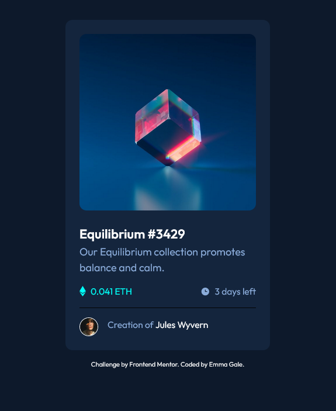

# Frontend Mentor - NFT preview card component solution

This is a solution to the [NFT preview card component challenge on Frontend Mentor](https://www.frontendmentor.io/challenges/nft-preview-card-component-SbdUL_w0U). Frontend Mentor challenges help you improve your coding skills by building realistic projects.

## Table of contents

- [Overview](#overview)
  - [The challenge](#the-challenge)
  - [Screenshot](#screenshot)
  - [Links](#links)
- [My process](#my-process)
  - [Built with](#built-with)
  - [What I learned](#what-i-learned)
  - [Continued development](#continued-development)
  - [Useful resources](#useful-resources)
- [Author](#author)

## Overview

### The challenge

Users should be able to:

- View the optimal layout depending on their device's screen size
- See hover states for interactive elements

### Screenshot

### Links

- Solution URL: [github.com/emjogale/nft-card-component](https://github.com/emjogale/nft-card-component)
- Live Site URL: [nft-card-component-psi.vercel.app/](https://nft-card-component-psi.vercel.app/)

## My process

### Built with

- Semantic HTML5 markup
- SCSS
- Flexbox
- Mobile-first workflow

### What I learned

I had a go at using SCSS - not sure how successfully. Also using pseudo elements to create the hover effects on the image.

### Continued development

More SCSS - maybe next time on a slightly bigger project to see how it can help with structuring the classes and start to use more of the features from it.

- [sass-lang.com/documentation](https://sass-lang.com/documentation) - I've only just scratched the surface of this!

- Frontend Mentor - [@emjogale](https://www.frontendmentor.io/profile/emjogale)
- Twitter - [@emmagale2635](https://www.twitter.com/emmagale2635)
